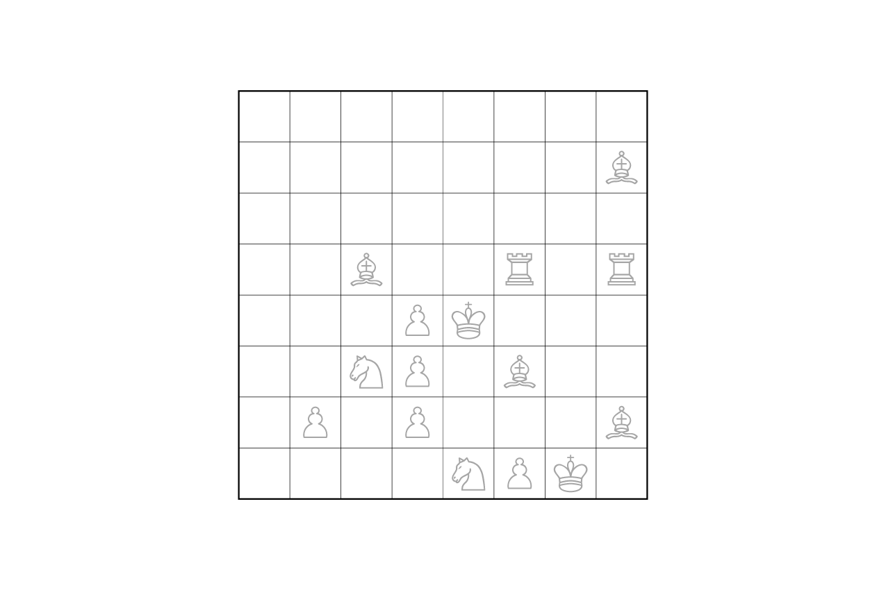
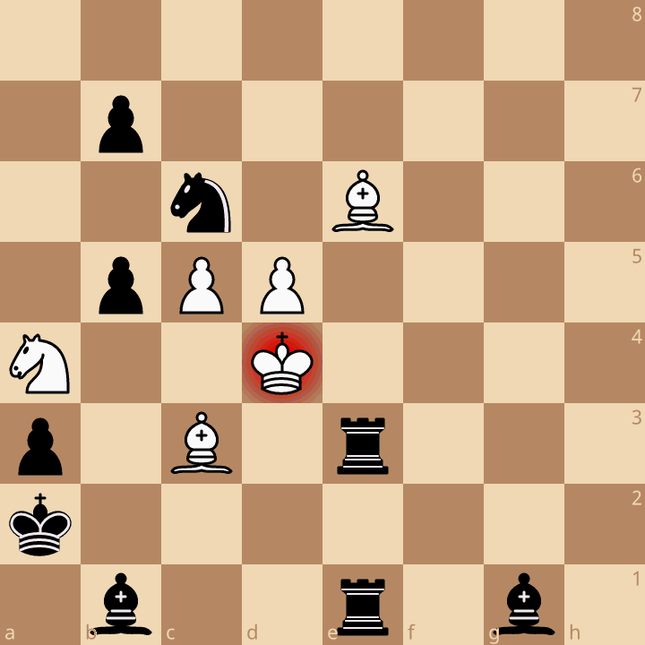

# Griddles Series B: Puzzle 2

## Problem statement

> Your friend sent you a photo and a message while watching two grandmasters
> play chess. Unfortunately, the photo is unclear. All the pieces look grey,
> all the squares look white, and you can't tell which way the board is
> facing.
>
> 1. It is Black to move.
> 2. One colour has exactly one more piece than the other.
> 3. The two rooks are of different colours.
> 4. No piece is on a square that matches its own colour.
> 5. There is a knight that is not threatened by any pawn.
> 6. There is a pawn that is threatened by a king.
> 7. Promotions have occurred in this game.
> 8. All knights are the same colour.
> 9. No bishop is protected by a knight.
> 10. Every piece has been moved in this game.
> 11. There is a bishop that threatens a king.
>
> All of the above statements about the game are &#95;&#95;&#95;&#95;&#95;.
> Can you also figure out who won this chess game?

All you can make out from the photo is **piece type** and **which square
each piece stands on** — not piece colour, not square colour, not which way
round the board is facing. That information is given as a FEN with every
piece written as if it were White, laid out on a standard board (a1 bottom
left):

```
8/7B/8/2B2R1R/3PK3/2NP1B2/1P1P3B/4NPK1
```



Fill in the blank (**TRUE** or **FALSE**), and work out who won.

---

## My solution

### Why the blank can't be TRUE

Statement 3 says the two rooks are different colours. Statement 4 says no
piece sits on a square whose colour matches the piece's own colour — i.e.
White pieces only ever stand on dark squares, and Black pieces only ever
stand on light squares.

If statement 4 is literally true, a piece's colour is **completely
determined** by the square it's standing on: dark square → White piece,
light square → Black piece. There's no freedom left to choose colours.

Now look at the two rook squares in the diagram (`f5` and `h5` in the given
orientation). They are two squares apart along the same rank. **The two rooks
always stand on squares of the same colour**, in every one of the four ways
you could be misreading the board's orientation (rotating it 0°, 90°, 180°,
270°, since you can't tell which way it's facing).

So if statement 4 holds, both rooks are forced to be the **same** colour.
This directly contradicts statement 3. Statements 3 and 4 can never both be
true, in any orientation. That rules out "all statements are TRUE".

### So the blank is FALSE

Since "all TRUE" is impossible, and the puzzle promises the blank must be **FALSE**

- every one of statements 1–11 is **false**,
- White is to move (statement 1 negated),
- the position is legal (exactly one king per side, the side **not** to move
  isn't in check, no pawn sits on the first rank or the back rank it should've promoted on),

### The solution

```
8/1p6/2n1B3/1pPP4/N2K4/p1B1r3/k7/1b2r1b1 w - - 0 1
```



**White:** Bc3, Be6, Nа4, Pc5, Pd5, Kd4 (6 pieces)
**Black:** Bb1, Bg1, Nc6, Re1, Re3, Pa3, Pb5, Pb7, Ka2 (9 pieces)

**White to move**, and is in check from the knight on c6 — with exactly one
legal reply: **d5c6+**. 

**Winner: Black mates in 2 moves, dxc6+ Rxe6+ 2. Kd5 bxc6#**

---

## Negating each statement, one by one

**1. It is Black to move.** → Negated: **White is to move.**

**2. One colour has exactly one more piece than the other.** → Negated:
**the piece-count gap isn't exactly one.** White has 6 pieces, Black has 9

**3. The two rooks are of different colours.** → Negated: **the two rooks
are the same colour.** Both Re1 and Re3 are Black.

**4. No piece is on a square that matches its own colour.** → Negated: **at
least one piece stands on a square of its own colour.** White's bishop on
e6 stands on a light square. A "White" piece on a "white" square.

**5. There is a knight that is not threatened by any pawn.** → Negated:
**every knight is threatened by an enemy pawn.** White's knight on a4 is
attacked by Black's pawn on b5. Black's knight on c6 is attacked by White's
pawn on d5.

**6. There is a pawn that is threatened by a king.** → Negated: **no pawn
is threatened by any king.** Kd4's reachable squares (c3–e5) contain no
opposite-coloured pawn. Ka2's reachable squares (a1–b3) contain no enemy pawn either.

**7. Promotions have occurred in this game.** → Negated: **no promotions
have occurred.** Each side still has exactly its original two bishops, one
on a light square and one on a dark square, so no promoted
bishop pair. It's a necessary but not sufficient condition but nothing about the piece counts requires a promotion to have 
happened.

**8. All knights are the same colour.** → Negated: **the knights are
different colours.** Na4 is White, Nc6 is Black.

**9. No bishop is protected by a knight.** → Negated: **some bishop is
protected by a friendly knight.** Nа4 defends Bc3.

**10. Every piece has been moved in this game.** → Negated: **some piece
has never moved.** b7 is still  on its originalstarting square.

**11. There is a bishop that threatens a king.** → Negated: **no bishop
threatens any king.** 
